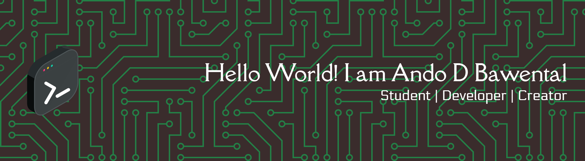

### 💻 Programming Languages

###  Skills

### IDE

### Course

## 📫 Let's Connect

✉️ Email: [bawentalando@gmail.com](mailto:bawentalando@gmail.com)
🌐 Personal Blog: [Coming Soon!]

## 🌐 Socials:
  

---

### 📊 GitHub Stats:
 
 

## 🏆 GitHub Trophies

### 🔝 Top Contributed Repo

---

### Play Games With me

<picture>
  <source media="(prefers-color-scheme: dark)" srcset="https://raw.githubusercontent.com/AndoBawental/AndoBawental/output/pacman-contribution-graph-dark.svg">
  <source media="(prefers-color-scheme: light)" srcset="https://raw.githubusercontent.com/AndoBawental/AndoBawental/output/pacman-contribution-graph.svg">
  
</picture>

###

  <i>"Infrastructure as poetry, code as art"🎨</i>

